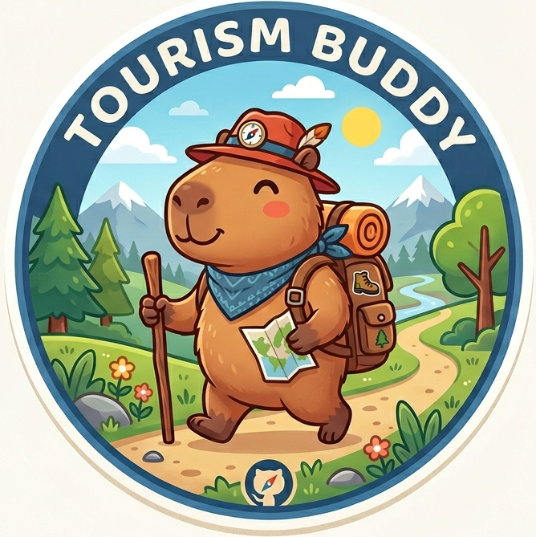

<div align="center">



<h1>Tourism Buddy · 旅游搭子.skill</h1>

<p><em>Your AI travel companion — planning, budgeting, packing, phrases, and scam alerts in one chat.</em></p>

<p><sub>"The world is a book, and those who do not travel read only one page."</sub></p>

[](./LICENSE)
[](https://www.python.org/)
[](https://claude.ai)
[](#requirements)
[](#contributing)

</div>

---

## See it in 30 seconds

> *The kind of help a smart friend who's already been there would give you — in one chat.*

```text
You ▸ Heading to Bangkok next week, first time in SE Asia, solo female traveler

Tourism Buddy ▸
  🚨 Before you land — 3 scams that target new arrivals at BKK airport:
     • "Grand Palace is closed today" tuk-tuk scam (HIGH risk, daily occurrence)
     • Taxi meter "broken" → demand flat ฿500 (real meter: ~฿350)
     • Fake temple donation monks near Wat Pho (very convincing, avoid eye contact)
  🧳 Packing flagged: temples require covered shoulders + knees — pack 1 light
     scarf (doubles as temple cover + aircon cardigan). Skip the hiking pants.
  🗣️ 5 phrases that will save you money TODAY:
     "Mai ao krap/ka" (ไม่เอาครับ/ค่ะ) → "No thanks" to touts, polite but firm
     "Tao rai?" (เท่าไหร่) → "How much?" — always ask before getting in
     "Pai ... krap/ka" (ไป...) → "Go to ..." — for taxis, shows you know the city
  🧭 Solo-female intel: Grab > street taxi after dark. Skytrain safer than
     tuk-tuks. Khao San nightlife = fine; Patpong = skip. Hotels in Sukhumvit
     or Silom > old city if it's your first time.
  💸 Realistic daily budget: ฿1,800/day (~$50) mid-range, ฿900/day backpacker.

You ▸ What about the food? I have a peanut allergy 🥜

Tourism Buddy ▸
  ⚠️ Thai cuisine uses peanuts constantly — pad thai, satay, som tam, many curries.
  🪪 Allergy card (show at restaurants, screenshot this):
     "ผมแพ้ถั่วลิสงอย่างรุนแรง ในอาหารทุกชนิด กรุณาตรวจสอบ ขอบคุณครับ"
     (I have a severe peanut allergy in all foods. Please check. Thank you.)
  ✅ Generally safe: tom yum goong, green curry (ask — some add peanut), 
     grilled seafood, mango sticky rice. Carry your EpiPen + translated Rx.
  🏥 Nearest international ER: Bumrungrad Hospital, Sukhumvit Soi 3.
     Emergency: 1669 (ambulance) / 1155 (tourist police, English).
```

**This is not a chatbot with pretty words.** Every phrase, scam, hospital number, and cultural rule above comes from this repo's structured data — verifiable, auditable, updatable by you.

---

## What it actually does

| Module | What it does | Ask it like this |
|---|---|---|
| 💰 **Budget Tracker** | Trip budgets across 8 categories, live expense logging, 3-tier alerts at 75/90/100% | *"Set up a $3000 Tokyo budget for 7 days"* |
| 🧳 **Packing Generator** | Climate-aware, activity-aware, family/accessibility modes, smart clothing quantities | *"What should I pack for 10 days in Bali?"* |
| 🗣️ **Phrase Book** | 8 languages × 6 categories × pronunciation guides, auto-detects language from city name | *"Give me Thai survival phrases"* |
| 🚨 **Scam Database** | 14+ documented scams worldwide with avoidance strategies, severity tags | *"Scams in Bangkok I should watch for?"* |
| 🗺️ **Itinerary Builder** | Day-by-day plans with geographic clustering, golden hours, backup rainy-day plans | *"5-day Tokyo itinerary for a foodie couple"* |
| 🧭 **Cultural Intelligence** | Do's/don'ts, dress codes, tipping norms, religious site etiquette | *"Is it OK to tip in Japan?"* |

Plus: visa checks, transit cheat sheets, emergency phrasebook, live tourist-site guide mode, budget backpacker mode, and 12 total capability phases in [`SKILL.md`](./SKILL.md).

---

## Install

### Claude Code — project-level

```bash
cd /path/to/your/project
mkdir -p .claude/skills/
git clone https://github.com/mengze-hong/tourism-buddy.git .claude/skills/tourism-buddy
```

### Claude Code — global (all projects)

```bash
mkdir -p ~/.claude/skills/
git clone https://github.com/mengze-hong/tourism-buddy.git ~/.claude/skills/tourism-buddy
```

Then just chat with Claude. Tourism Buddy activates automatically on any travel-related prompt (trip, flight, hotel, itinerary, Tokyo, visa, packing, scam, etc.).

### Try the scripts directly — no Claude needed

```bash
# Packing list for a cold-weather hike
python scripts/packing_generator.py Iceland cold 7 hiking photography

# Japanese survival phrases
python scripts/phrase_book.py japanese quick

# Scam report for Bangkok
python scripts/scam_database.py Bangkok

# Budget demo (writes to a temp dir, your data/ stays clean)
python scripts/budget_tracker.py
```

---

## Sample outputs

<details>
<summary><b>🧳 Packing list — 10 days Bali, beach + temple + hiking</b></summary>

```text
Pack 4 days of clothing — laundry is available, wash every ~4 days.

Documents & ID ────────────────────
[ ] Passport (check 6-month validity!)
[ ] Visa / e-visa printout
[ ] Travel insurance documents
...

Climate (Tropical) ────────────────
[ ] Lightweight breathable clothing
[ ] Quick-dry underwear
[ ] Waterproof phone case
[ ] Reef-safe sunscreen
...

Activity: Temple ──────────────────
[ ] Long pants/skirt (knee-covering)
[ ] Shoulder-covering shirts
[ ] Slip-on shoes (easy removal)
...
```
</details>

<details>
<summary><b>🚨 Scam alert — Bangkok</b></summary>

```text
# TOURIST SCAM ALERT — Bangkok   (9 relevant warnings)

1. [HIGH] Gem / Carpet 'Investment' Scam
   A "friendly local" takes you to a gem shop swearing stones are worth 10×
   back home. They're worthless fakes.
   → Never buy high-value items from strangers. Take 24h to decide.

2. [HIGH] Motorbike Rental Damage Scam
   They claim you scratched it (it was already scratched).
   → NEVER leave your passport as deposit. Photo/video before renting.

3. [MED] Closed Attraction Redirect
   "Oh, the Grand Palace is closed today!" (It's not.)
   → Walk to the entrance and check yourself.
```
</details>

<details>
<summary><b>🗣️ Japanese quick card</b></summary>

```text
QUICK CARD — Japanese
----------------------------------------
  Hello                     Kon-nee-chee-wah
  Thank you                 Ah-ree-gah-toh go-zai-mahs
  Please                    Oh-neh-gai-shee-mahs
  Excuse me                 Sue-mee-mah-sen
  How much does this cost?  Ee-koo-rah des-kah?
  Where is the bathroom?    Toy-reh wah doh-koh des-kah?
  Water, please             Oh-mee-zoo oh koo-dah-sai
  The bill, please          Oh-kai-kei oh oh-neh-gai-shee-mahs
  Help!                     Tah-sue-keh-teh!
  I don't understand        Wah-kah-ree-mah-sen
```
</details>

More full examples in [`examples/`](./examples/).

---

## Why this over a generic "travel chatbot"?

- **Structured workflows, not vibes.** 12 phases (profiling → research → itinerary → budget → packing → culture → food → transport → safety → on-site guide → shopping → special modes). See [`SKILL.md`](./SKILL.md).
- **Honest.** If a spot is overhyped or a tourist trap, it says so and recommends alternatives.
- **Real data, real scripts.** 14+ documented scams, 8 language phrase books, budget math that alerts before you overspend — not hallucinations, actual lookup tables you can audit in [`scripts/`](./scripts/).
- **Private by default.** Your trip data lives in `data/` locally and is gitignored. Nothing phones home.
- **Zero dependencies.** Pure Python standard library. No pip install, no API keys, no accounts.

---

## Supported destinations

**30+ cities** with phrase auto-detection and scam coverage, plus `worldwide` fallback scams for everywhere else:

`Tokyo` · `Kyoto` · `Osaka` · `Bangkok` · `Chiang Mai` · `Phuket` · `Bali` · `Paris` · `Rome` · `Venice` · `Barcelona` · `Madrid` · `Istanbul` · `Seoul` · `Busan` · `Berlin` · `Munich` · `Vienna` · `Zurich` · `Prague` · `Lisbon` · `Athens` · `Hanoi` · `Ho Chi Minh City` · `Siem Reap` · `Delhi` · `Jaipur` · `Agra` · `Cairo` · `Marrakech` · `Cancun` · `Bogotá` · `Halong Bay` · `Shanghai` · `Beijing` · `Taipei` · …

**8 languages:** Japanese · Thai · Spanish · Mandarin · French · Korean · Italian · German

---

## Project structure

```text
tourism-buddy/
├── SKILL.md                    # Skill entry point — 12 travel phases
├── README.md                   # You are here
├── LICENSE                     # MIT
├── logo.png
├── scripts/
│   ├── budget_tracker.py       # Trip budgets + expense logging
│   ├── packing_generator.py    # Climate/activity-aware packing lists
│   ├── phrase_book.py          # 8-language survival phrases
│   └── scam_database.py        # 14+ scams with avoidance strategies
├── assets/                     # Markdown templates (itinerary, quick facts)
├── examples/                   # Real sample trip plans
├── references/                 # Visa reference + full scam guide
└── data/                       # Your local trip JSON (gitignored)
```

---

## Contributing

The things I'd love help with:

- 🌍 **New scam reports** from your actual travels — every contribution keeps someone safer.
- 🗣️ **A new language** to the phrase book (see [`scripts/phrase_book.py`](./scripts/phrase_book.py) — just add a dict).
- 📍 **New destinations** to the language map.
- 🐛 **Bug reports** or feature ideas via issues.

```bash
git clone https://github.com/mengze-hong/tourism-buddy.git
# hack → test → PR
```

---

## Requirements

| | |
|---|---|
| Python | 3.8+ |
| Dependencies | **None** (standard library only) |
| Claude Code | Required for the conversational skill experience |
| Works offline | ✅ All scripts run fully offline |

---

<div align="center">

**If Tourism Buddy helped plan a trip, give it a ⭐**

Built for travelers, by travelers.

MIT License · [SKILL.md](./SKILL.md) · [Examples](./examples/) · [Report a scam](https://github.com/mengze-hong/tourism-buddy/issues/new)

</div>
